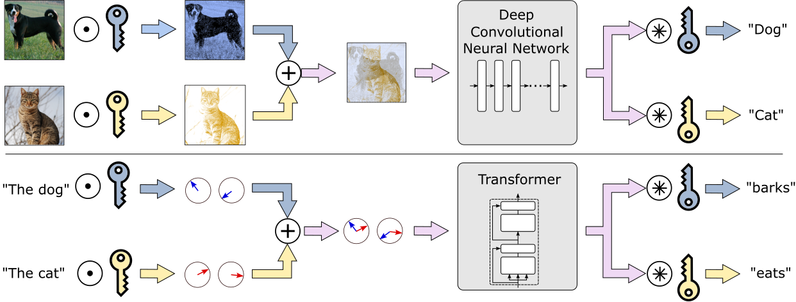

# MIMONets: Multiple-Input-Multiple-Output Neural Networks Exploiting Computation in Superposition


### Nicolas Menet, Michael Hersche, Geethan Karunaratne, Luca Benini, Abu Sebastian, Abbas Rahimi

_NeurIPS'23_

<div align="center">
  
</div>

This repository contains the implementation of MIMOConv and MIMOFormer. Details and instructions can be found in the corresponding folder. 

## [[Paper]](https://openreview.net/pdf?id=ox7aynitoW)

## Citation

If you use the work released here for your research, please cite our paper:
```
@article{menet2023mimo,
  title={MIMONets: Multiple-Input-Multiple-Output Neural Networks Exploiting Computation in Superposition},
  author={Menet, Nicolas and Hersche, Michael and Karunaratne, Geethan and Benini, Luca and Sebastian, Abu and Rahimi, Abbas},
  journal={Advances in Neural Information Processing Systems (NeurIPS)},
  volume={36},
  year={2023}
}
```


## License
Please refer to the LICENSE file for the licensing of our code.
